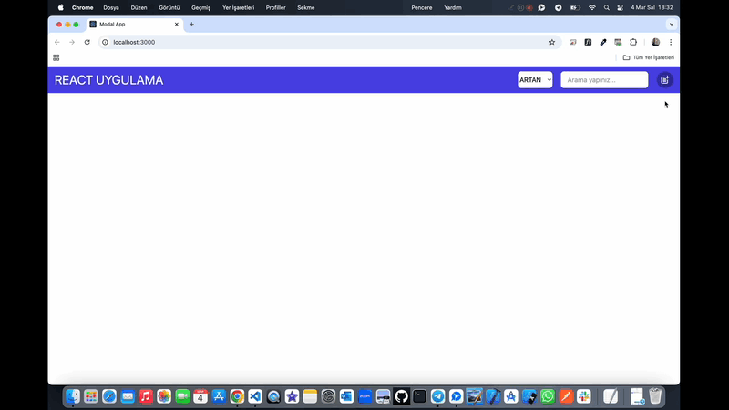

# Modal-App 🚀

<li>Bu proje React-Redux altyapı ile oluşturulmuş Modal yardımıyla dinamik kartlar oluşturma,ekleme,güncelleme,silme özelliklerini barındırır.</li>

# Kullanılan Teknolojiler 🎨

<li>⭐ React</li>
<li>⭐ Redux</li>
<li>⭐ Tailwind</li>
<li>⭐ React-Icons</li>
<li>⭐ Modal</li>
  
# Ekran Görüntüsü 🎥
      

# İletişim 📩
yunusemreoral@hotmail.com.tr

